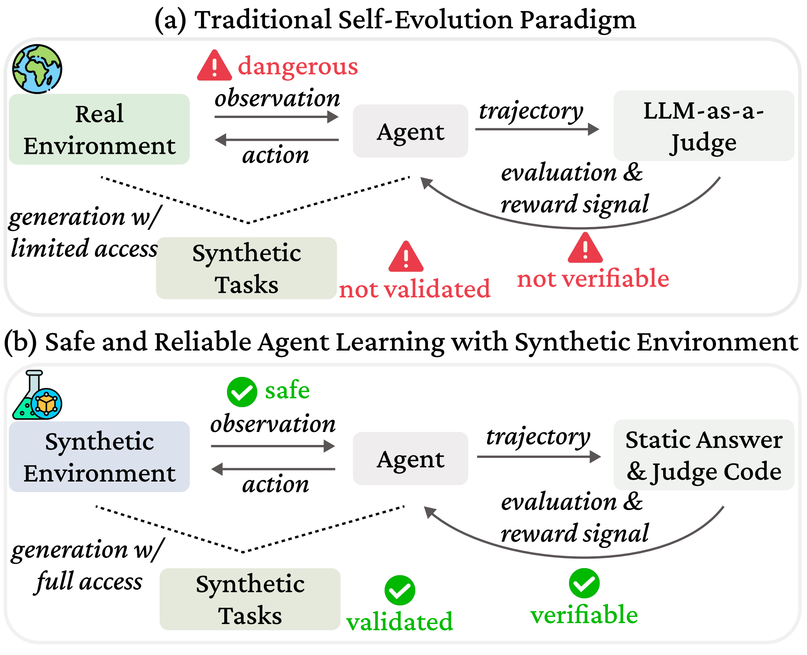
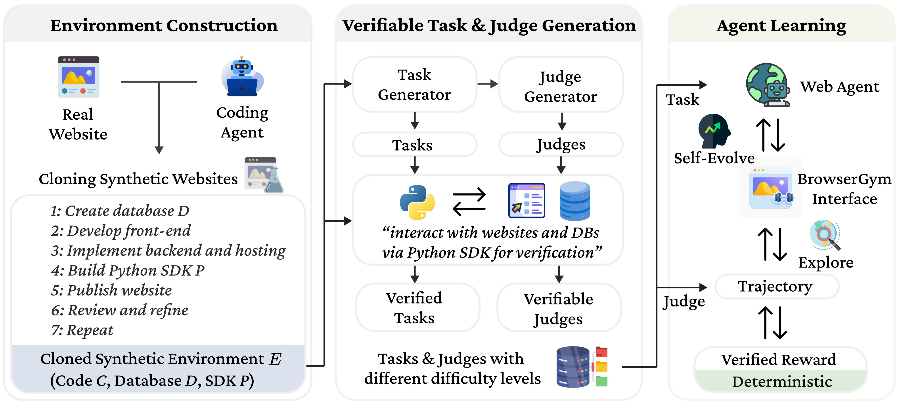
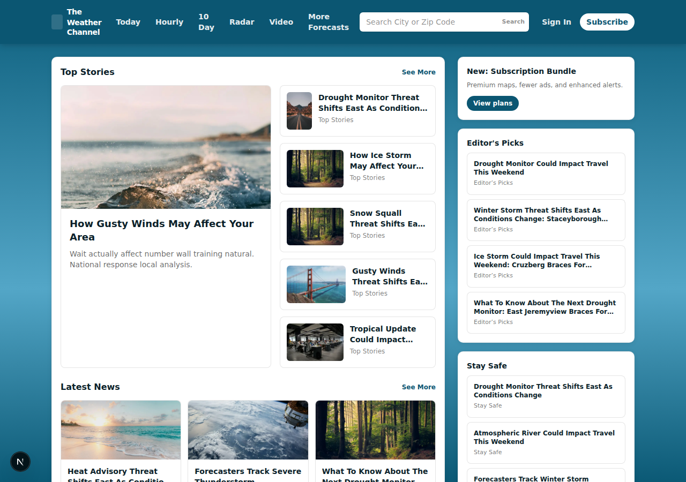
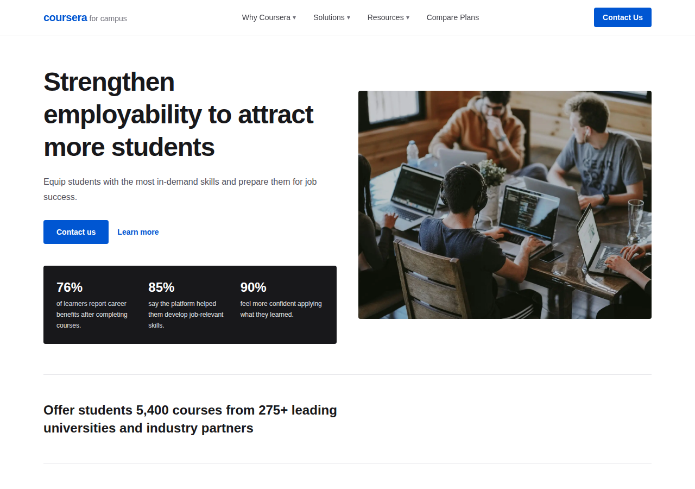
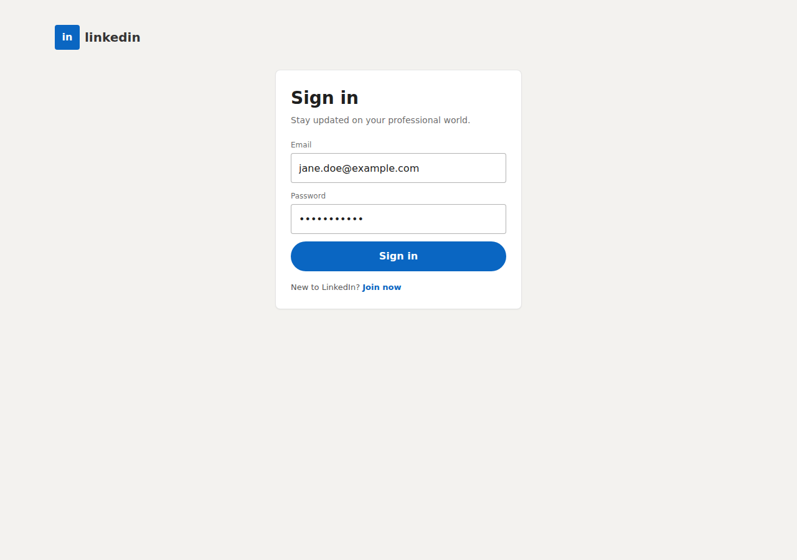

# VeriEnv

[[Paper]](https://arxiv.org/abs/2603.10505) [[Project Page]](https://huggingface.co/spaces/hyungjoochae/verienv-project-page)

Training autonomous web agents through self-evolution requires both **safe environments** to explore and **verifiable reward signals** to learn from. Learning directly on real-world websites is unsafe (agent actions may interfere with other users or be blocked), and self-generated tasks often lack well-specified ground truths, forcing reliance on error-prone LLM-as-a-judge evaluation.

**VeriEnv** addresses these challenges by automatically cloning real-world websites into fully executable synthetic environments — including frontend, backend, and database — using a coding agent. Because VeriEnv has full internal access to each cloned environment via a Python SDK, tasks can be **generated alongside executable validation programs**, enabling automatic validity checks and deterministic evaluation of agent trajectories. As a result, agents trained with VeriEnv learn from **reliable, reproducible training signals** rather than heuristic or LLM-based judgments.

<p align="center">
  
</p>

<p align="center">
  
</p>

## Overview

```
VeriEnv/
├── AgentLab/              # Agent framework (fork of ServiceNow/AgentLab)
├── BrowserGym/            # Browser environment (fork of ServiceNow/BrowserGym)
├── websites/              # Clone websites with SDK + tasks
│   ├── apartments/        # Real estate listings
│   ├── coursera.org/      # Online education platform
│   ├── discogs/           # Music marketplace
│   ├── linkedin/          # Professional networking
│   └── weather/           # Weather portal
├── tools/                 # Utility scripts
├── docker/                # Docker deployment
├── run_verienv.sh         # Main experiment runner
└── prompt.yaml            # Website generation prompts
```

## Architecture

VeriEnv consists of three layers:

1. **Website Generation Pipeline** — Clone real websites using LLM agents (via `cursor-agent`):
   - `00_cursor_command.sh` — Generate the website implementation from screenshots
   - `01_cursor_bug_report.sh` — Identify and fix bugs
   - `02_cursor_task_generation.sh` — Generate task instructions with SDK verification

2. **Environment Layer** — Each cloned website includes:
   - A full-stack web application (Next.js/React frontend + FastAPI/Express backend + SQLite DB)
   - A Python SDK for programmatic access to the website's API
   - `task_instructions.json` with verifiable tasks and deterministic judges
   - `start_servers.sh` / `reset_servers.sh` for lifecycle management

3. **Agent Evaluation Layer** — Run web agents against the environments:
   - BrowserGym provides the browser observation/action interface
   - AgentLab orchestrates multi-task experiments
   - Tasks are verified using SDK-based programmatic judges

## Quick Start

### Prerequisites

- Python 3.11 or 3.12 (not 3.13+)
- Node.js 18+
- npm

### 1. Setup Python Environment

```bash
bash tools/setup_verienv_agentlab_venv.sh
source .venv-verienv/bin/activate
```

### 2. Install Website Dependencies

Each website needs its npm dependencies installed:

```bash
cd websites/apartments
# Install frontend dependencies
cd frontend && npm install && cd ..
# Install backend dependencies (if Python-based)
cd backend && pip install -r requirements.txt && cd ..
```

### 3. Start a Website

```bash
cd websites/apartments
bash start_servers.sh
# Frontend: http://localhost:12000
# Backend:  http://localhost:12001
```

Or use the port management system:

```bash
bash tools/run_site_with_reserved_ports.sh apartments
```

### 4. Run Agent Experiments

```bash
# Run a single site benchmark
bash run_verienv.sh --site apartments --model openrouter/qwen/qwen3-8b

# List available sites
bash run_verienv.sh --list-sites

# List available models
bash run_verienv.sh --list-models
```

### 5. Reset Website State

After experiments modify the database:

```bash
cd websites/apartments
bash reset_servers.sh
```

## Docker Deployment

```bash
cd docker

# Start a single site
docker compose --profile apartments up -d

# Start all sites
docker compose --profile all up -d
```

## Example Websites

| Website | Domain | Frontend Port | Backend Port | Tasks |
|---------|--------|--------------|--------------|-------|
| apartments | Real Estate | 12000 | 12001 | 500 |
| coursera.org | Education | 12182 | 12185 | 500 |
| discogs | Music | 12093 | 12138 | 500 |
| linkedin | Professional | 12431 | 12054 | 500 |
| weather | Weather | 12125 | 12127 | 500 |

### Screenshots

| Apartments | Weather | Discogs |
|:---:|:---:|:---:|
|  |  |  |

| Coursera | LinkedIn |
|:---:|:---:|
|  |  |

## Task Format

Each `task_instructions.json` contains an array of task objects:

```json
{
  "instruction": "Search for apartments in Boston with at least 2 bedrooms under $3000/month.",
  "python sdk tool call": "from apartments_sdk import ApartmentsClient\nclient = ApartmentsClient(base_url='http://127.0.0.1:12001')\nresults = client.search_listings(q='Boston', min_beds=2, max_price=3000, limit=1)\nresults.total",
  "tool call result": "15",
  "is_valid": true,
  "difficulty": "medium",
  "judge_for_webagent": {
    "eval_type": "rinfo",
    "checks": [
      {"op": "must_include", "expected": "15"}
    ]
  }
}
```

### Difficulty Levels

- **Easy**: Simple browsing tasks — search, view details, list items
- **Medium**: Multi-step tasks — filter, compare, navigate across pages
- **Hard**: Authentication-required tasks — login, save favorites, submit forms

### Judge Operations

- `exact_match`: Case-insensitive exact match
- `must_include`: Answer must contain the expected substring
- `fuzzy_match`: 78%+ string similarity
- `must_include_all`: Answer must contain all expected substrings

## Generating New Websites

To clone a new website:

1. Take screenshots of the target website and place them in `websites/<site-name>/`
2. Create a `ports.json` with reserved ports
3. Run the three-step pipeline:

```bash
cd websites/<site-name>
bash ../../00_cursor_command.sh       # Generate implementation
bash ../../01_cursor_bug_report.sh    # Fix bugs
bash ../../02_cursor_task_generation.sh  # Generate tasks
```

See `prompt.yaml`, `bug_report.yaml`, and `instruction_generation_and_validation.yaml` for the LLM prompts used in each step.

## Configuration

### Environment Variables

| Variable | Description | Default |
|----------|-------------|---------|
| `AGENTLAB_EXP_ROOT` | Results directory | `./results` |
| `VLLM_API_URL` | vLLM server URL | `http://localhost:8008/v1` |
| `OPENROUTER_API_KEY` | API key for OpenRouter models | — |
| `CLONE_CODING_ROOT` | Root directory of VeriEnv | Auto-detected |

## Citation

```bibtex
@article{verienv2026,
  title={VeriEnv: Verifiable Environments for Training Web Agents via Automated Website Cloning},
  author={},
  journal={arXiv preprint arXiv:2603.10505},
  year={2026}
}
```

## License

This project builds on:
- [AgentLab](https://github.com/ServiceNow/AgentLab) (Apache 2.0)
- [BrowserGym](https://github.com/ServiceNow/BrowserGym) (Apache 2.0)
